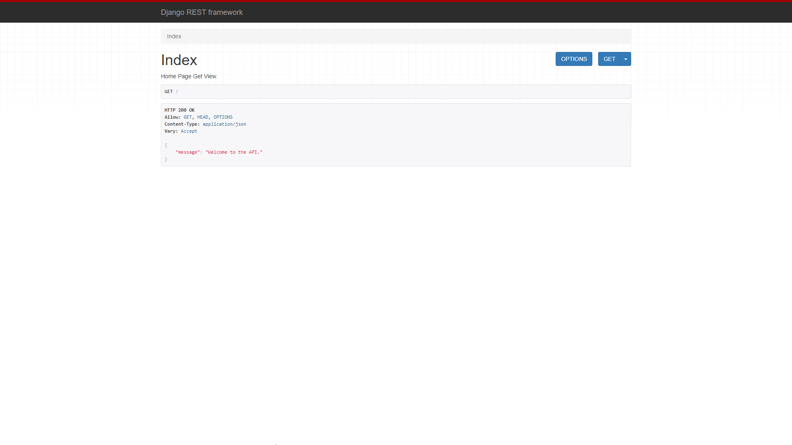

> A Django REST starter project. 

## 🚀 Features

- Django 4.0.2 & Python 3.9
- Install via [Pip](https://pypi.org/project/pip/)
- User log in/out, sign up, password reset via [django-allauth](https://github.com/pennersr/django-allauth) , [dj-rest-auth](https://dj-rest-auth.readthedocs.io/en/latest/index.html)
- Static files configured with [Whitenoise](http://whitenoise.evans.io/en/stable/index.html)
- REST API with [djangorestframework](https://www.django-rest-framework.org/)




## 📖 Installation
DjangoREST-X can be installed via Pip. To start, clone the repo to your local computer and change into the proper directory.

```
$ git clone https://github.com/PraveenMalethia/DjangoREST-X
$ cd DjangoREST-X
```

### Pip (Windows)

```
> python3 -m venv env
> env/scripts/activate
(env) > pip install -r requirements.txt
(env) > python manage.py migrate
(env) > python manage.py createsuperuser
(env) > python manage.py runserver
# Load the site at http://127.0.0.1:8000
```
### Pip (linux or mac)

```
$ python3 -m venv env
$ source env/bin/activate
(env) $ pip install -r requirements.txt
(env) $ python manage.py migrate
(env) $ python manage.py createsuperuser
(env) $ python manage.py runserver
# Load the site at http://127.0.0.1:8000
```


## Setup

```
# Run Migrations
(env) > python manage.py migrate

# Create a Superuser
(env) > python manage.py createsuperuser

# Confirm everything is working:
(env) > python manage.py runserver

# Load the site at http://127.0.0.1:8000
```
